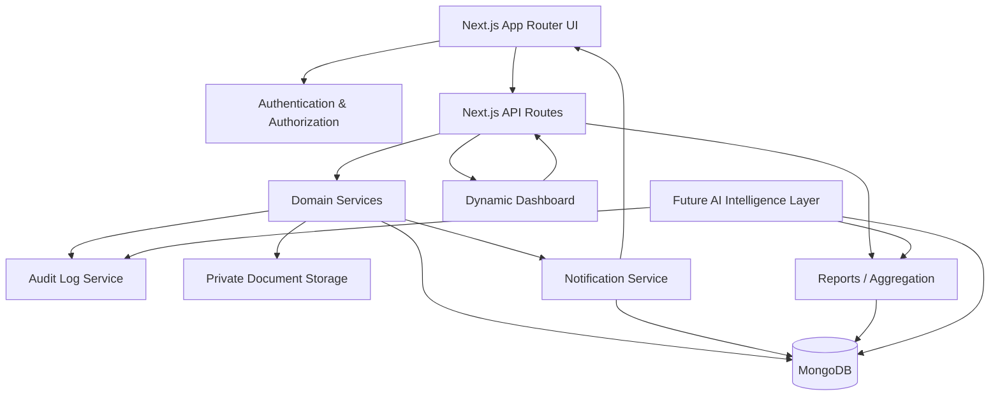

# QMS AI — Quality Management System

> **Enterprise-oriented Quality Management System built with Next.js, MongoDB and role-based access control, with a secure document repository, live operational dashboard and cross-module reporting foundation for future AI-powered quality intelligence.**

QMS AI is a modular, multi-tenant Quality Management System designed to centralize quality operations, controlled records, master data, permissions and audit history in one application.

The current implementation focuses on the **QMS core**. The AI layer is intentionally positioned as the next intelligence layer on top of trusted QMS data rather than as a replacement for the transactional system.

---

## Why QMS AI?

Traditional QMS applications store quality information. QMS AI is designed to go one step further:

- **QMS** captures and controls quality records.
- **Dashboard** turns live records into operational KPIs.
- **Reports** provides cross-module analysis.
- **Audit trail** provides accountability and traceability.
- **AI layer (roadmap)** can later explain trends, identify recurring issues, recommend corrective actions and surface quality risks.

This separation keeps the QMS as the **system of record** while AI becomes the **intelligence layer**.

---

## Key Features

### Quality Management Modules

- Dashboard
- Non-Conformance (NCR)
- Corrective & Preventive Action (CAPA)
- Audits
- Controlled Documents
- Training
- Suppliers
- Products
- Master Data
- Locations
- Organizations
- Users
- Roles & Permissions
- Page Metadata
- Profile & Settings
- Audit Logs
- QMS Reports
- Notifications (assignment alerts)

### Security & Governance

- Session-based JWT authentication using an HTTP-only authentication cookie
- Role-based and permission-based authorization
- Multi-tenant organization scoping
- Dedicated `SUPER_ADMIN` global-user handling
- Organization-level data isolation for tenant users
- Audit logging for important business and administrative actions
- Sensitive audit fields are designed to be sanitized before persistence

### Dynamic Dashboard

The dashboard is backed by live MongoDB data rather than hard-coded KPI values.

Current dynamic dashboard areas include:

- Open NCR count
- Open CAPA count
- Pending audits
- Document count and monthly document updates
- NCR/CAPA activity trend
- NCR closure-rate trend
- Open NCR distribution by category
- CAPA status distribution
- Recent QMS activity from the audit trail
- Overdue NCRs
- Overdue CAPAs
- Overdue audits
- Documents approaching review date

The dashboard respects the authenticated user's organization scope.

### QMS Reports

The Reports module provides live cross-module reporting for a selectable date range.

Current report coverage includes:

- NCR
- CAPA
- Audits
- Documents
- Training
- Suppliers

Breakdowns include status, category, severity, department, audit type, document type, training type and supplier category where those fields exist in the underlying QMS models.

The report page also provides CSV export for the high-level report summary.

---

### Assignment Notifications

QMS AI notifies a user in-app whenever a record is assigned (or reassigned) to them, so ownership of quality work is never missed in the noise of a shared dashboard.

Notification triggers currently include:

- 🔴 **NCR assigned** to a user
- 🟠 **CAPA assigned** to a user
- 🟡 **Audit assigned** as auditor/auditee
- 🔵 **Document** routed for review/approval
- 🟢 **Training** assigned to a user

<details>
<summary><strong>▶ How it works (click to expand)</strong></summary>

```text
Record Created / Updated
   (NCR, CAPA, Audit, Document, Training)
            │
            ▼
   Assignment field changes
   (assignedTo / owner / approver)
            │
            ▼
   Notification Service
            │
   ├── Persist notification (MongoDB, org-scoped)
   ├── Push to in-app bell (real-time via polling/WebSocket)
   └── (optional) Email/queue hook for future channels
            │
            ▼
   Assigned User
            │
   ├── Bell icon shows unread badge count
   ├── Dropdown lists recent notifications
   ├── Click → deep-links to the NCR/CAPA/Audit/Document/Training record
   └── Mark as read / Mark all as read
```

</details>

<details>
<summary><strong>▶ Example notification payload (click to expand)</strong></summary>

```json
{
  "type": "CAPA_ASSIGNED",
  "module": "CAPA",
  "recordId": "66f0c2...",
  "recordCode": "CAPA-2026-0143",
  "assignedTo": "64a1f9...",
  "assignedBy": "64a1a2...",
  "organizationId": "64990c...",
  "message": "You have been assigned CAPA-2026-0143: Root cause analysis pending",
  "isRead": false,
  "createdAt": "2026-09-05T10:15:00Z"
}
```

</details>

Notifications are organization-scoped, tied to the existing RBAC/permission layer, and are recorded through the same audit-aware service pattern used by the rest of the QMS core — no record is assigned silently.

---

## Controlled Document Management

The Documents module supports two document sources:

```text
Document Source
    │
    ├── Upload Document
    │      └── Select local file
    │
    └── Document URL
           └── Enter external URL
```

### Local document upload

Uploaded documents are stored outside the public web directory using an organization-scoped storage key.

The database stores document metadata such as:

- Original file name
- MIME type
- File size
- Source (`UPLOAD` / `URL`)
- Secure storage key
- Document metadata and revision information

The physical storage path is **not exposed to the browser**.

### Tokenized document viewing

For uploaded documents, the application creates a short-lived signed document-access token before opening the document.

```text
Authenticated User
        │
        ▼
Document Access Endpoint
        │
        ├── Authentication check
        ├── Organization/document scope check
        └── Short-lived signed token
                │
                ▼
       Secure Document Endpoint
                │
        ├── Token signature check
        ├── Token expiry check
        ├── User active check
        ├── Document ownership/scope check
        └── Private file read
                │
                ▼
          Stream document
```

An invalid or expired token does not expose the file and returns an authorization error.

Default upload limit is **20 MB**. Supported upload types currently include common PDF, Microsoft Office, text/CSV and image document formats.

> **Production note:** the current storage abstraction is designed for private server storage. It can later be backed by private object storage such as S3 without changing the Documents UI contract.

---

## Architecture



### Architectural principles

1. **System of record first** — QMS transactions remain authoritative.
2. **Service-oriented business logic** — domain services keep business rules outside UI components.
3. **API boundary** — browser clients communicate through application APIs rather than directly accessing MongoDB.
4. **Tenant isolation** — organization users are scoped to their organization.
5. **Global administration** — `SUPER_ADMIN` is intentionally global and may operate without an organization ID.
6. **Centralized master data** — QMS reference values such as statuses, departments and document types are resolved through the QMS reference/master-data layer.
7. **Auditability** — significant operations generate audit records.
8. **Secure file access** — uploaded documents are private and delivered through controlled access endpoints.

---

## Application Structure

```text
src/
├── app/
│   ├── (auth)/                 # Login / password flows
│   ├── (protected)/            # Authenticated application pages
│   │   ├── dashboard/
│   │   ├── ncr/
│   │   ├── capa/
│   │   ├── audits/
│   │   ├── documents/
│   │   ├── training/
│   │   ├── suppliers/
│   │   ├── reports/
│   │   ├── notifications/
│   │   ├── settings/
│   │   └── administration/
│   └── api/                    # Application API routes
│
├── components/                 # Reusable UI and QMS components
│   └── notifications/          # Notification bell, dropdown, badge
├── context/                    # Authentication context
├── hooks/                      # Reusable React hooks
├── lib/
│   ├── api/                    # Browser API clients
│   ├── auth/                   # Auth/session/authorization helpers
│   ├── db/                     # MongoDB connection
│   └── validation/             # Validation utilities
├── models/                     # Mongoose models
├── services/                   # Domain/business services
├── scripts/                    # Seed and maintenance scripts
└── types/                      # Application types
```

---

## Backend Domain Model

The application currently uses Mongoose models for core QMS entities including:

- `User`
- `Organization`
- `Role`
- `Permission`
- `NCR`
- `CAPA`
- `Audit`
- `Document`
- `Training`
- `Supplier`
- `Product`
- `Location`
- `MasterData`
- `PageMetadata`
- `AuditLog`
- `Notification`

Each transactional QMS module follows the same general pattern:

```text
UI Component
    ↓
API Client
    ↓
Next.js API Route
    ↓
Authentication / Authorization
    ↓
Domain Service
    ↓
Mongoose Model
    ↓
MongoDB
```

---

## Multi-Tenant Security Model

QMS AI uses organization-aware data access.

### SUPER_ADMIN

- Global application administrator
- `organizationId` is intentionally nullable
- Can operate across organizations where the relevant service supports global access

### Organization Users

- Belong to an organization
- Business records are scoped to their organization
- Permissions are resolved from their role and permission assignments

This model avoids assigning artificial organizations to global users while maintaining tenant isolation for normal organization users.

---

## Audit Trail

The centralized audit-log model captures events such as:

- Create
- Update
- Delete
- Status changes
- Authentication/security events
- Administrative changes
- Module-specific business actions

Audit entries retain actor snapshots and support organization/module/record-level filtering.

This provides the foundation for traceability and also gives the future AI layer historical quality context.

---

## AI Roadmap

The project is named **QMS AI** because the long-term objective is to add an intelligence layer on top of the existing QMS.

### Planned AI capabilities

#### AI QMS Assistant

Natural-language questions such as:

- "How many open NCRs do we have?"
- "Which department has the highest NCR count?"
- "Show overdue CAPAs."
- "What were the major audit findings this quarter?"

#### AI-assisted NCR Analysis

- Classification suggestions
- Severity suggestions
- Possible root causes
- Containment recommendations
- Corrective/preventive action suggestions

#### AI-assisted CAPA

Use NCR details and historical QMS records to suggest corrective and preventive actions.

#### Quality Intelligence

- Recurring NCR detection
- Trend explanation
- Supplier risk indicators
- Quality anomaly detection
- Predictive risk scoring

The design goal is **human-in-the-loop AI**: AI recommends and explains; authorized quality users approve official QMS decisions.

---

## Technology Direction

The uploaded application source confirms the following core technologies and patterns:

- Next.js App Router
- React
- JavaScript / JSX
- MongoDB
- Mongoose
- JWT / JOSE-based authentication
- Tailwind CSS utility classes
- Recharts for dashboard visualizations
- Lucide React icons

The application is structured so that domain services, API routes, models and reusable UI components remain separated.

---

## Security Considerations

### Authentication

Authentication uses a signed JWT stored in an HTTP-only cookie.

### Authorization

Sensitive operations are protected through permission checks such as document create/update/delete/status permissions.

### Tenant isolation

Organization users cannot arbitrarily select another organization for normal tenant-scoped operations.

### Document security

Uploaded files are stored privately and are not intended to be served as public static assets. Access is mediated through short-lived signed document tokens.

### Secrets

Environment secrets such as database credentials and JWT secrets must never be committed to source control.

---

## Environment Variables

At minimum, the application expects the existing authentication/database configuration to provide values for the MongoDB connection and JWT signing secret.

For secure document access, the application supports:

```env
MONGODB_URI=your-mongodb-connection-string
JWT_SECRET=your-long-random-secret
JWT_EXPIRES_IN=30d
DOCUMENT_TOKEN_SECRET=another-long-random-secret
DOCUMENT_TOKEN_EXPIRES_IN=10m
```

`DOCUMENT_TOKEN_SECRET` can fall back to `JWT_SECRET`, but a dedicated document-token secret is recommended for production.

Never commit a real `.env` file.

---

## Local Document Storage

Uploaded documents are stored under a private server-side storage area rather than the Next.js `public` directory.

Recommended production `.gitignore` entries:

```gitignore
/storage/documents/*
!/storage/documents/.gitkeep
```

For horizontally scaled production deployments, private object storage is recommended instead of local disk.

---

## Screenshots

The repository should contain implementation screenshots under:

```text
docs/screenshots/
├── dashboard.png
├── reports.png
├── ncr.png
├── capa.png
├── documents.png
├── audits.png
└── administration.png
```

> **Note:** screenshots are intentionally not fabricated from source code. Add screenshots from the running application so the GitHub README always represents the actual UI.

Example Markdown once screenshots are added:

```md


```

---

## Recruiter Highlights

This project demonstrates practical experience with:

- Enterprise application architecture
- Next.js App Router
- React component architecture
- MongoDB/Mongoose data modeling
- REST-style API design
- JWT authentication
- RBAC and permission-based authorization
- Multi-tenant SaaS architecture
- Master-data-driven business rules
- Audit trail and traceability
- Secure private document delivery
- Dynamic dashboards and data aggregation
- Cross-module reporting
- Extensible architecture for AI integration

The project is especially relevant to roles involving **Full Stack Development, Solution Architecture, SaaS platforms, Enterprise Applications, QMS/ERP systems and AI-enabled business applications**.

---

## Development Approach

The application follows a modular approach so that individual QMS domains can evolve independently while sharing common infrastructure:

- Authentication
- Authorization
- Master data
- QMS references
- Audit logging
- Organization scoping
- API clients
- Reusable UI components

This reduces duplication and makes it easier to introduce additional QMS modules and future AI capabilities without rewriting the core platform.

---

## Current Project Status

### Implemented

- Authentication and session management
- RBAC / permissions
- Multi-organization architecture
- NCR
- CAPA
- Audits
- Documents
- Training
- Suppliers
- Products
- Master Data
- Locations
- Organizations
- Users
- Roles
- Permissions
- Audit Logs
- Dynamic Dashboard
- QMS Reports
- Secure local document upload and tokenized document viewing
- In-app assignment notifications (NCR, CAPA, Audits, Documents, Training)

### Next Engineering Layer

- AI QMS Assistant
- AI-generated quality insights
- AI-assisted NCR/CAPA analysis
- Predictive quality risk
- Advanced report/export capabilities
- Private object storage integration for production deployments

---

## Project Vision

```text
              QMS AI
                 │
       ┌─────────┴─────────┐
       │                   │
      QMS              Intelligence
       │                   │
  ┌────┼────┐        ┌─────┼─────┐
  NCR CAPA Audit     Analyze Recommend Predict
  │    │    │             │       │       │
  └────┴────┴─────────────┴───────┴───────┘
                 │
            Quality Data
                 │
              MongoDB
```

**The goal is not simply to build another QMS. The goal is to build a QMS that can understand its own quality data.**

---

## Author

**Santosh Kumar**  
Senior Full Stack Developer & Solution Architect

Core areas of expertise include React, Next.js, Node.js, Express.js, MongoDB, PostgreSQL, PHP, AWS-oriented deployments, enterprise application architecture and full-stack development.

---

## License

Add the project's chosen license before making the repository public. If this is a portfolio/recruiter demonstration project, a standard open-source license should be selected deliberately rather than assuming one.
